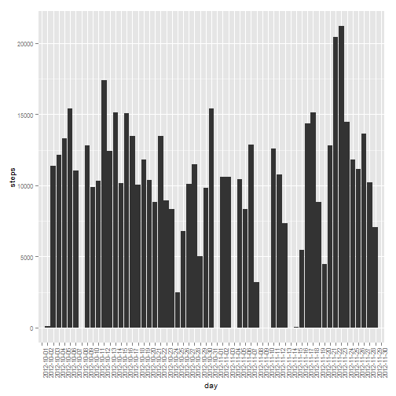
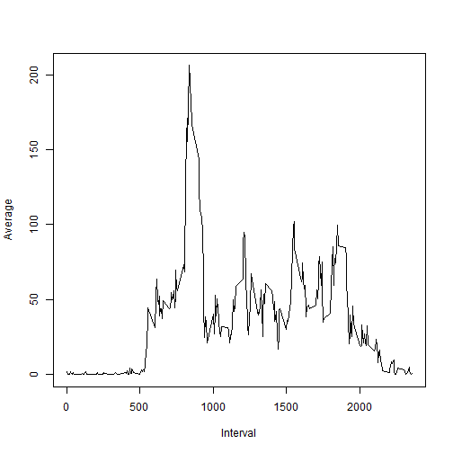
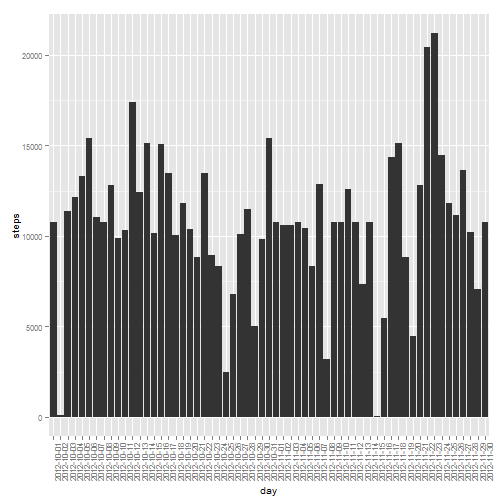

## Loading and preprocessing the data
>Including Libraries

```r
library("ggplot2")
```

```
## Warning: package 'ggplot2' was built under R version 3.0.3
```
>Reading Data

```r
unzip("Activity.zip")
data <- read.csv("activity.csv")
```
## What is mean total number of steps taken per day?
>Preparing Data

```r
sumvec <- rowsum(data$steps, data$date)
new.df <- cbind.data.frame(rownames(sumvec), sumvec)
colnames(new.df) <- c("day", "steps")
```
>Plotting Data

```r
m <- ggplot(new.df, aes(x=day, y = steps)) + 
      geom_histogram(stat = "identity") + theme(text = element_text(size=10),
       axis.text.x = element_text(angle=90, vjust=1)) 
print(m)
```

```
## Warning: Removed 8 rows containing missing values (position_stack).
```

 
>Mean and Median

```r
steps.mean <- mean(sumvec, na.rm = TRUE)
steps.median <- median(sumvec, na.rm = TRUE)
print(paste("Mean is ", steps.mean, " and Median is ", steps.median))
```

```
## [1] "Mean is  10766.1886792453  and Median is  10765"
```
## What is the average daily activity pattern?
>Preparing Data

```r
new.df <- NULL
it <- unique(data$interval)
for(i in 1:length(it))
{
  new.df <- rbind.data.frame(new.df, c(it[i], mean(data$steps[data$interval == it[i]], na.rm = TRUE)))
  
}
colnames(new.df) <- c("Interval", "Average") 
```
>Plotting Data

```r
plot(new.df, type="l")
```

 
>Maximum Activity

```r
print(paste("Maximum Activity happens at", new.df$Interval[new.df$Average == max(new.df$Average)], "with value ", max(new.df$Average)))
```

```
## [1] "Maximum Activity happens at 835 with value  206.169811320755"
```
## Inputing missing values
>Missing Values

```r
print(paste("Number of Missing Values : ", nrow(data[is.na(data$steps),])))
```

```
## [1] "Number of Missing Values :  2304"
```
>Substituting Values.

The average value of each interval has been substituted for each NA case, rounded off to integer using R's round() function.

```r
data2 <- data
for(i in 1:nrow(data2))
{
  if(is.na(data2$steps[i]))
  {
    data2$steps[i] <- round(new.df$Average[new.df$Interval == data2$interval[i]])
  }
}
head(data2)
```

```
##   steps       date interval
## 1     2 2012-10-01        0
## 2     0 2012-10-01        5
## 3     0 2012-10-01       10
## 4     0 2012-10-01       15
## 5     0 2012-10-01       20
## 6     2 2012-10-01       25
```

>Preparing Histogram, and calculating mean and median

```r
sumvec2 <- rowsum(data2$steps, data2$date)
new2.df <- cbind.data.frame(rownames(sumvec2), sumvec2)
colnames(new2.df) <- c("day", "steps")

m2 <- ggplot(new2.df, aes(x=day, y = steps)) + 
      geom_histogram(stat = "identity") + theme(text = element_text(size=10),
       axis.text.x = element_text(angle=90, vjust=1)) 
print(m2)
```

 

```r
steps2.mean <- mean(sumvec2, na.rm = TRUE)
steps2.median <- median(sumvec2, na.rm = TRUE)
print(paste("Mean is ", steps2.mean, " and Median is ", steps2.median))
```

```
## [1] "Mean is  10765.6393442623  and Median is  10762"
```
Mean and Median changed upon filling the missing values. There was considerable change in the median and slight change in mean.
## Are there differences in activity patterns between weekdays and weekends?
